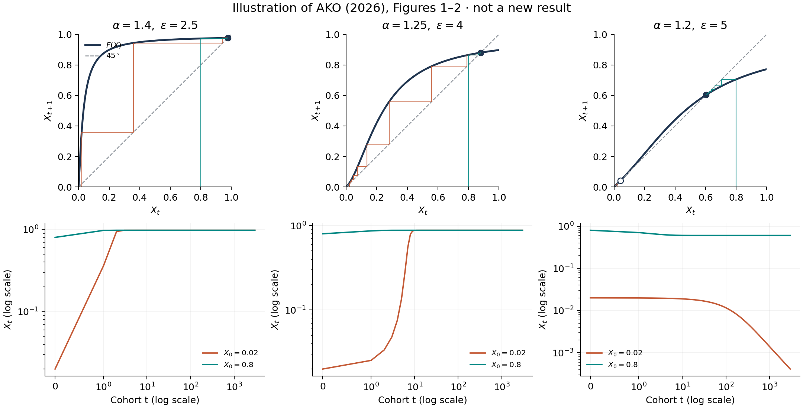
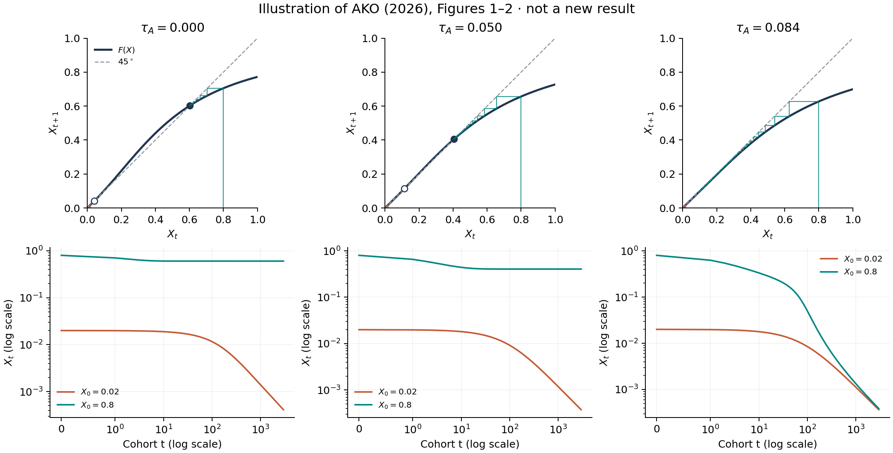

# Prompts and actual raw outputs

The original task below is preserved verbatim from the supplied attachment, including its line breaks. The follow-up records the identity-check authorization. Selected real user-visible assistant responses follow verbatim, without polishing. This is a selected raw record, not a fabricated complete transcript or a claim that the user independently wrote the analysis. Tool orchestration and most progress messages are omitted. The numerical stdout is preserved separately below. Final edited explanations are in `analysis.md`; they are not passed off as a raw conversation.

## Original user prompt — verbatim

```text
Repository 4 — Acemoglu, Kong & Ozdaglar (2026), NBER Working Paper 34910,
"AI, Human Cognition and Knowledge Collapse." Course: AI-Econ-Modeling,
alexanderquispe/AI-Econ-Modeling, Issue #3.

Setup (already done, don't redo it):
- Repo `ai-04-acemoglu` under github.com/fgalarzac already exists and is public.
  You are editing it, not creating it.
- Working branch `apoyo` already exists — use it, don't create `analysis` or
  any other branch. Never commit directly to `main`.
- Confirm `gh auth status` shows `fgalarzac` before writing or pushing
  anything; stop and tell me if it doesn't.

I want you to actually think through this paper, not follow a checklist.
Read the whole PDF (papers/07-acemoglu-kong-ozdaglar-2026-knowledge-collapse.pdf
in the course repo, cross-checked against the current NBER version at
nber.org/papers/w34910) before writing anything. Where you're not sure
whether something is the authors' claim, your own derivation, or your
interpretation, say so explicitly and tell me which one it is — don't blur
these. Use your own judgment throughout; I'm not prescribing the order or
the exact steps, only the questions that need real answers.

What I need you to figure out and get right, in your own way:

- The paper's real question: why does agentic AI help decisions today but
  can erode society's stock of general knowledge over time, and what is
  "knowledge collapse"? Use the paper's own examples (medical, investment)
  where they clarify the model.
- The exact numbering of the paper's sections. The course issue says the
  static problem and Observation 1 are "Sections 2 and 3.4" — check this
  directly against the PDF. I already suspect Section 2 is Related
  Literature and the static problem is actually Section 3; verify it
  yourself and tell me plainly if the issue is wrong, don't silently
  correct it in the README as if it were never an issue.
- The agent's static optimization problem: objective, choice variable, the
  effort cost 1/α · e^α with α > 1, the constraint e ≥ 0, the FOC, and what
  happens at the corner X_t = 0. Walk through why each piece of the model
  is there, not just the algebra.
- Observation 1 in full: why public precision X_t complements effort while
  agentic-AI precision τ_A substitutes for it, where each cross-partial
  sign comes from, and what Assumption 1 (Δ_I = 0, Δ_X > 0) is doing for
  the result. Be precise about the boundary case X_t = 0.
- The dynamic recursion X_t → e_t → E_t → X_{t+1} and the steady-state
  structure (Lemma 2, Propositions 3 and 5): why α − 1 vs. 1/4 (equivalently
  the effort elasticity ε = 1/(α−1) vs. 4) determines whether there's one
  stable high-knowledge steady state or a knowledge-collapse trap can
  coexist with it. This part is read-only in the sense that I don't want
  you reproducing the formal proofs (Lemma A-1 through A-5) — understand
  and explain what they establish, cite them, don't re-derive them.
- The welfare trap the issue flags: is welfare increasing in agentic
  accuracy τ_A? Work out the direct effect (mechanical gain from better
  personalized precision) vs. the indirect effect (crowd-out lowering X̄_h),
  and under what conditions welfare is non-monotone. Then check, section by
  section, which assumptions the authors themselves relax in Section 5
  (community vs. AI aggregation; synthetic data; imperfect separability of
  effort) against the full list in Assumption 1 and the cost function — and
  tell me which assumption is never relaxed anywhere in the paper. Don't
  default to "Δ_I = 0 → Δ_I > 0" just because it's the extension the course
  README suggests; check it against Section 5 yourself and tell me whether
  it's actually touched there or not.

A simulation I want, as an illustration and not a re-derivation of the
proofs: code the state transition map F(X) using the paper's own functions
(G(τ) = 2Φ(√τ) − 1, g(τ) = φ(√τ)/√τ, the FOC pinning down e(X, τ_A)),
iterate X_{t+1} = F(X_t) from a positive initial condition, and show — with
cobweb diagrams and time paths — how the dynamics change as α crosses the
α − 1 = 1/4 threshold, and separately as τ_A crosses the complete-collapse
threshold τ_A^c in the elastic regime. This is visualizing Figures 1 and 2
of the paper, not a new result — say so explicitly wherever you write it
up, and use your own judgment on parameter values, as long as you state
them clearly.

Deliverables (the floor, all in English):
- README.md — one page: the question, the agent's problem, the main result
  with all its conditions.
- prompts.md — this prompt, verbatim, and the real raw output, unedited.
- extensions.md — 2-3 candidate extensions, each checked against what
  Section 5 already covers, so nothing is presented as new that isn't.
- hand/ — I will add the handwritten photo myself; leave a placeholder and
  one line in the README once I tell you what it shows.
- presentation.tex and presentation.pdf — title slide with the repo link,
  plus (1) the paper and the agent's problem, (2) the main result with all
  its conditions, (3) what I did, (4) where I didn't trust the AI and my
  verdict, with the hand photo referenced. If the material genuinely needs
  one or two more slides — to not cram the math or to fit the simulation
  cleanly — add them; use your judgment, just keep the whole deck
  presentable in about 5 minutes, no animations, no screenshots of the
  paper, all equations typeset in LaTeX.
- sim.py — the simulation described above, with the plots saved as figures
  referenced from the presentation or README.

Git: work only on `apoyo`. Before committing, check git status, make sure
the PDF is gitignored, and scan for anything that shouldn't be public
(credentials, leftover ai-01-aouad template content). Commit with a small,
descriptive message, push to origin/apoyo, open the PR against main. Don't
merge and don't comment on the issue — I'll review first and do both myself.

Stop and ask me, instead of guessing, if: the active GitHub account isn't
fgalarzac, the two PDF versions (course repo vs. current NBER) disagree on
anything that changes which section is "the static problem," or you're
genuinely unsure whether something belongs under PAPER, DERIVATION,
INTERPRETATION, or OPEN QUESTION.
```

## Follow-up user prompt

```text
Yes, proceed using the connector's verified identity — that satisfies the
intent of the check (confirming the active account is fgalarzac before
writing or pushing). No need to install gh CLI just for this.
Before you push anything, confirm explicitly: (1) the target repo is
fgalarzac/ai-04-acemoglu, and (2) the branch is `apoyo`, not a new branch
or main. Show me that confirmation, and a summary of what you're about to
commit, before you push.[@GitHub](plugin://github@openai-curated-remote) 
```

## Raw assistant response 1

The GitHub connector confirms the account is **`fgalarzac`**, but `gh` is unavailable on PATH and in the standard installation locations checked, so I cannot satisfy your explicit `gh auth status` requirement.

Nothing has been written or pushed. May I proceed using the connector’s verified identity, or should we set up GitHub CLI first?

## Raw assistant response 2

Both versions agree on the section numbering: the static payoff is in §3.3, Observation 1 in §3.4, and the effort optimization in §3.5. The May version expresses costs using effort elasticity ε; I’ll translate it explicitly to your α notation.

One substantive caveat is already clear: the welfare optimum can be at zero AI precision, so “an interior optimum” needs extra conditions. I also found a threshold-equality inconsistency between the prose and Appendix A, which I’ll flag rather than repeat.

## Raw assistant response 3

The Section 5 audit confirms that **Δ_I = 0 is never relaxed** in either version: context-specific knowledge alone remains unproductive. The authors also retain Δ_X > 0 and the power effort cost. §5.1 changes aggregation capacity, §5.2 adds synthetic precision, and §5.3 changes the public-learning input to e^β. Thus, relaxing Δ_I = 0 is a legitimate candidate extension relative to this paper—but it is not the only maintained assumption.

The repository still contains the earlier paper’s README, slides, extensions, and handwritten PDF. I’ll replace that template content and leave an honest placeholder for your own photo. I have finished reading all 69 pages of the course-linked version, including both appendices; the simulation will illustrate its Figures 1 and 2, without reproducing the dynamic proofs.

## Raw assistant response 4

The first parameter trial produced collapse even without agentic AI, so it would not illustrate the requested transition. I’m adjusting aggregation capacity to show both regimes clearly, with the same positive starting values across panels. The code checks the effort FOC, the zero corner, and the number of fixed points instead of relying on the plots alone.

## Raw assistant response 5

The simulation now shows the intended changes. With the stated illustrative parameters, the complete-collapse threshold is approximately **τ_Aᶜ = 0.06698**. Below it, low and high initial knowledge lead to different outcomes; above it, both paths decline toward zero. The numerical checks pass, with a maximum log-FOC residual below 4 × 10⁻¹³.

I’m preparing the deck and the detailed notes, keeping the README compact and marking the photo as pending.

## Raw successful simulation stdout

```json
{
  "purpose": "Illustration of AKO Figures 1 and 2; not a new result or proof",
  "baseline": {
    "alpha": 1.2,
    "tau_a": 0.0,
    "prior_precision": 0.5,
    "lambda_i": 1.0,
    "lambda_g": 1.0,
    "island_size": 1000.0,
    "drift_variance": 1.0,
    "delta_x": 1.0,
    "delta_g": 0.0
  },
  "tau_a_critical": 0.0669779008996462,
  "critical_x": 0.23575576129925177,
  "initial_conditions": [
    0.02,
    0.8
  ],
  "periods": 3000,
  "alpha_cases": [
    {
      "alpha": 1.4,
      "positive_fixed_points": [
        0.9769918226999357
      ]
    },
    {
      "alpha": 1.25,
      "positive_fixed_points": [
        0.8803278274186369
      ]
    },
    {
      "alpha": 1.2,
      "positive_fixed_points": [
        0.0415929046906759,
        0.6032695984097336
      ]
    }
  ],
  "tau_cases": [
    {
      "tau_a": 0,
      "positive_fixed_points": [
        0.0415929046906759,
        0.6032695984097336
      ],
      "terminal_X": [
        0.0004115790233554738,
        0.6032695984097327
      ]
    },
    {
      "tau_a": 0.05023342567473465,
      "positive_fixed_points": [
        0.1136505122500098,
        0.40538237657727083
      ],
      "terminal_X": [
        0.0003768389846349868,
        0.40538237657727233
      ]
    },
    {
      "tau_a": 0.08372237612455774,
      "positive_fixed_points": [],
      "terminal_X": [
        0.0003643527782455106,
        0.00038550685745153304
      ]
    }
  ],
  "validation": {
    "max_log_FOC_residual": 3.8546943414985435e-13,
    "critical_peak_residual": -2.531308496145357e-13,
    "checks": "FOC, corner, map bounds and monotonicity, AI crowd-out, root counts passed"
  }
}
```

## Raw first generated analysis artifact

This is the exact first `analysis.md` emitted by the assistant as a file in this run, preserved unedited. It is a generated document output, not a reconstructed chat message.

````markdown
# Reading and static analysis

**PAPER** denotes the authors' statements; **DERIVATION** denotes my calculations from their primitives; **INTERPRETATION** denotes my economic reading; **OPEN QUESTION** denotes work not established here. References use the May 5 MIT version unless specified; [source audit](paper/README.md) records both downloads.

## What collapses, and why

**PAPER (§§1, 3.1–3.2).** The common state follows a Gaussian random walk with innovation variance $\Sigma^2>0$. A cohort inherits posterior precision $X_t$ about that state. Each individual's independent context has prior precision $b=\sigma^{-2}>0$. Learning gives private precision $\lambda_Ie$ and a thin public contribution; aggregation across an island produces precision $\lambda_G E_t$. Private and AI signals about context add to $Y=b+\lambda_Ie+\tau_A$.

The medical example distinguishes knowledge of disease mechanisms and treatments from a patient's symptoms and physical condition. The investment example distinguishes financial instruments and market institutions from the investor's risk tolerance, horizon, and exposure to other income risks. Learning often produces both sorts of information together. An atomistic, short-lived agent benefits privately from understanding their context, but ignores their contribution to future cohorts' general knowledge.

**INTERPRETATION.** AI crowds out a privately chosen activity that supplies a public benefit. The dynamic problem is the lost spillover, not irrational refusal to use information. The random walk makes old information less useful even if it is perfectly stored. At baseline collapse, $X_t\to0$, effort tends to zero, but context precision tends to $b+\tau_A$. The model does not endogenize the failure of the AI signal itself as general knowledge dwindles. Under $\Delta_I=0$, that surviving context information cannot produce incremental value alone. Thus “all knowledge is destroyed” is too broad a literal description.

## The agent's optimization

**PAPER (§§3.1, 3.3–3.5).** Write $\Delta_G=f(1,0)-f(0,0)$, $\Delta_I=f(0,1)-f(0,0)$ and $\Delta_X=f(1,1)-f(1,0)-f(0,1)+f(0,0)$. Monotonicity, normalization and Assumption 1 imply $\Delta_I=0$, $\Delta_X>0$, $\Delta_G\ge0$, and $\Delta_G+\Delta_X=1$. Leontief is one example ($\Delta_X=1$), not a necessary restriction on the whole paper.

Agents first choose effort and then form posterior-mean predictions. Gaussian error with precision $q$ lies within the unit success band with probability $G(q)=2\Phi(\sqrt q)-1$. The public and private predictions yield expected utility

$$U(e;X,\tau_A)=f(0,0)+\Delta_GG(X)+\Delta_XG(X)G(b+\lambda_Ie+\tau_A)-\frac{e^\alpha}{\alpha}.$$

The choice is $e\ge0$; inherited $X$ and supplied $\tau_A$ are parameters, not privately chosen knowledge stocks. The $\Delta_G$ term values general knowledge alone but gives no private effort incentive because the agent cannot individually change public precision. The interaction term rewards joint success. Convex effort cost restrains learning and makes marginal cost $e^{\alpha-1}$ increasing. The nonnegative constraint matters at zero public precision.

**DERIVATION (notation).** MIT's cost is $\varepsilon e^{(\varepsilon+1)/\varepsilon}/(\varepsilon+1)$. Set $\alpha=1+1/\varepsilon$ to recover $e^\alpha/\alpha$, with $\alpha>1$ equivalent to $\varepsilon>0$. Varying this exponent is not relaxing the constant-elasticity functional form.

**DERIVATION (static differentiation, matching Observation 1).** For $q>0$,

$$g(q)=\frac{\phi(\sqrt q)}{\sqrt q}>0,\qquad g'(q)=-\frac{1+1/q}{2}g(q)<0.$$

Therefore, with $Y=b+\lambda_Ie+\tau_A$,

$$U_e=\Delta_X\lambda_IG(X)g(Y)-e^{\alpha-1},$$
$$U_{ee}=\Delta_X\lambda_I^2G(X)g'(Y)-(\alpha-1)e^{\alpha-2}<0\quad(e>0).$$

For $X>0$, marginal benefit at $e=0$ is positive. Marginal cost becomes unbounded while the benefit declines, giving a unique positive solution to $U_e=0$. The singularity of $c''(e)$ at zero for $1<\alpha<2$ does not undermine strict concavity or this argument. At $X=0$, the objective reduces to $f(0,0)-e^\alpha/\alpha$; the unique maximum is $e=0$. The derivative equals zero there, and the nonnegativity constraint binds. Starting at positive $X$, the model stays strictly positive at every finite date: collapse is a limit.

## Observation 1 and its precise domain

**PAPER (§3.4), DERIVATION of signs.** Holding effort fixed while differentiating,

$$U_{eX}=\Delta_X\lambda_Ig(X)g(Y)>0,\qquad U_{e\tau_A}=\Delta_X\lambda_IG(X)g'(Y)<0\quad(X>0).$$

Public precision raises the payoff to marginal private learning because production is complementary. AI improves the same private precision as effort; diminishing returns in $G$ make that improvement lower effort's marginal benefit. Dividing these cross-partials by the negative $U_{ee}$ in the implicit FOC gives $e_X>0$ and $e_{\tau_A}<0$ for $X>0$, as Observation 2 states.

**Boundary qualification — DERIVATION.** At $X=0$, $e(0,\tau_A)=0$ for every finite AI precision and $U_{e\tau_A}=0$. The public cross-partial is not a finite derivative there: $g(X)$ diverges as $X\downarrow0$. Do not print strict interior inequalities as valid at zero. Public complementarity remains meaningful as increasing differences and a strictly increasing best response when moving into $X>0$.

**Role of Assumption 1.** $\Delta_X>0$ supplies strict public complementarity. $\Delta_I=0$ makes the private return entirely proportional to $G(X)$ and is essential to the zero-effort collapse boundary. It is stronger than necessary for the interior signs: adding $\Delta_I>0$ keeps $U_{eX}$ positive and gives $U_{e\tau_A}=\lambda_I[\Delta_I+\Delta_XG(X)]g'(Y)<0$, but removes the zero boundary. See [extension 1](extensions.md).

## Dynamics: read, explained, not re-proved

**PAPER (Proposition 1).** Symmetry gives $E_t=Ie_t$. Gaussian updating adds $\lambda_G E_t$ to inherited precision, while next period's state drift adds variance. The resulting map is

$$F(X)=\left[\Sigma^2+(X+\lambda_GIe(X,\tau_A))^{-1}\right]^{-1},\quad F(0)=0.$$

It is continuous, strictly increasing and bounded by $\Sigma^{-2}$ (Lemma 1). Larger $I$ shifts it up; higher $\tau_A$ shifts it down for $X>0$ (Proposition 2). Holding $X$ fixed, $I$ does not enter the private FOC: its incentive benefit operates through future inherited public knowledge.

**PAPER (Lemma 2 and its accompanying explanation).** Near zero, maintaining public knowledge requires effort of order $X^2$, whereas chosen effort has order $X^{\varepsilon/2}$. With $\varepsilon<4$, enough learning remains to replenish a small stock. With $\varepsilon>4$, learning shrinks faster than maintenance needs and zero attracts nearby states. Equivalently, the steady-state public success benefit behaves locally like $e^{1/4}$, compared with marginal cost $e^{\alpha-1}$. These are the authors' asymptotic results, not a replication of their proofs.

**PAPER (Propositions 3, 5).** For $\varepsilon<4$, zero remains a fixed point, but every positive initial condition approaches the sole positive steady state. For $\varepsilon>4$, the complete-collapse threshold may be zero, so coexistence is not guaranteed merely by elastic effort. For $\tau_A<\tau_A^c$, zero and $\bar X_h$ are stable and $\bar X_m$ separates their basins. Equality $X_0=\bar X_m$ stays at the unstable state. For $\tau_A>\tau_A^c$, all initial conditions approach zero.

**Equality caveats.** Lemma 2 and these propositions do not classify $\alpha=1.25$ ($\varepsilon=4$). The illustration at that value is parameter-specific, not a theorem extending either strict case. Appendix A.4 explicitly states that at $\tau_A=\tau_A^c>0$ a positive double root remains. This conflicts with §4.1's broader “$\ge$” language. We use strict $>$ for inevitable collapse. **INTERPRETATION from the stated map geometry:** the tangency attracts from above and repels from below; starting exactly there remains there. No threshold-equality proof is reproduced.

The appendix results establish more than a local heuristic:

| Result read | What it establishes |
|---|---|
| Lemma A-1 | Links the sign of the steady-state effort residual to $F(X)-X$. |
| Lemma A-2 | Log marginal benefit is strictly concave in log effort, constraining the number of positive steady states. |
| Lemma A-3 | Low- and high-effort asymptotics of the public success function, including the one-quarter power. |
| Lemma A-4 | Its effort elasticity decreases from $1/4$, supporting the global crossing arguments. |
| Lemma A-5 | High-state effort's response to AI precision, used to compare crowd-out with direct precision gains. |

Appendix A.4 uses these ingredients to establish Propositions 3 and 5; A.5 establishes Lemma 2. This repository cites and explains their roles without reproducing their proofs.

## Welfare: two effects, not a blanket sign

**PAPER (§§4.1–4.3).** Welfare is representative-cohort steady-state utility net of $f(0,0)$, not discounted transition welfare. On a smooth positive high branch,

$$\bar U^+=\Delta_GG(\bar X_h)+\Delta_XG(\bar X_h)G(\bar Y_h)-\frac{\bar e_h^\alpha}{\alpha}.$$

**DERIVATION (envelope calculation, matching §4.3).** Differentiate along the steady state. All explicit $d\bar e_h/d\tau_A$ terms cancel by the private FOC, leaving

$$\frac{d\bar U^+}{d\tau_A}=\underbrace{\Delta_XG(\bar X_h)g(\bar Y_h)}_{DE>0}+\underbrace{g(\bar X_h)[\Delta_G+\Delta_XG(\bar Y_h)]\frac{d\bar X_h}{d\tau_A}}_{-IE<0}.$$

The first term holds inherited knowledge fixed and measures better personalized information. The second captures lower public knowledge after future cohorts crowd out effort. Envelope cancellation does **not** remove this dynamic externality. Welfare rises precisely when $DE>IE$.

**PAPER (Propositions 10–11, Appendices B.4–B.5).** Under Assumption 2, $b\ge\sqrt2-1$, the ratio $IE/DE$ increases along the high branch. If $DE(0)>IE(0)$, welfare initially rises and later falls, giving a positive interior optimum. Otherwise the optimum is zero AI precision. For $\varepsilon<4$, high-state welfare tends to zero as AI precision tends to infinity, though positive knowledge persists for every finite precision. For $\varepsilon>4$ and a nonempty positive branch ($\tau_A^c>0$), its optimum lies below collapse; crossing the collapse threshold can cause a discontinuous welfare loss. Initial conditions below $\bar X_m$ already select zero welfare. Thus improving AI can hurt through both the high-state level and basin selection.

Without Assumption 2, the single-peak theorem is not guaranteed; §4.3's footnote discusses more complicated profiles. In the elastic regime, even $\bar Y_h$ can fall near collapse because effort crowd-out exceeds the direct precision gain (Proposition 8). Increasing aggregation raises high-state welfare and expands its basin (Proposition 9). These statements hold within their stated model, not as empirical forecasts or general regulatory advice.

## Simulation and verification

**NUMERICAL ILLUSTRATION of PAPER Figures 1–2, not a new result.** Run `python sim.py` after installing `requirements.txt`. No randomness or fitted parameters: $\lambda_I=\lambda_G=\Sigma^2=\Delta_X=1$, $I=1000$, $b=0.5$, $\Delta_G=\Delta_I=0$; $X_0\in\{0.02,0.8\}$, 3,000 transitions. $X_0$ is the code's indexing convention for the paper's initial $X_1$.

First hold $\tau_A=0$ and compare $\alpha=1.4,1.25,1.2$. The positive fixed points are approximately $0.976992$; $0.880328$; and $(0.041593,0.603270)$, respectively. The equality panel is an illustration only. Next hold $\alpha=1.2$ and compare $\tau_A=0$, $0.75\tau_A^c$, and $1.25\tau_A^c$. Numerically $\tau_A^c\approx0.0669779$, with tangency at $X\approx0.235756$. At $0.75\tau_A^c$, the two positive roots are approximately $(0.113651,0.405382)$; above the threshold there are none.




Cobwebs display the first 70 steps; time paths display all 3,000 with log scales to reveal slow approach to zero. Collapse paths are still positive at the final simulated date (around $0.0004$); the limit claim comes from the paper, not from falsely declaring a small number equal to zero.

The FOC is solved in log effort with bracketed roots. `erf` evaluates $G$ accurately near zero. A log flow-balance residual locates positive fixed points and the maximum defining the numerical threshold; a grid precedes peak refinement. This is numerical root-finding, not the appendix proof. Checks cover FOC residuals, the zero corner, bounded and increasing $F$, AI crowd-out, and root counts. Raw results are saved in `figures/results.json`. Initial exploratory $I=100$ had no positive branch in the elastic regime and was rejected for this illustration; it is not evidence against Proposition 5, which allows $\tau_A^c=0$.

````

## User

Finalmente, en la carperta Lean crea una presentación en pdf de lo hallado. Esta debe de tener al menos una diapositiva con la formalización. Por otro lado, actualiza la parte de promts a este último.
